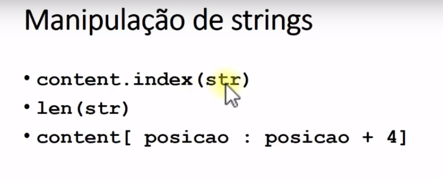

# Web Crawler e Strings

O principio do Crawler é procurar dentro do texto html as informações que são relevantes, observando as informações que estão sempre do lado das informações relevantes.

Iremos utiliza o site ClimaTempo como exemplo.
Ao inspencionar a páginar e verificar o código html iremos buscar algumas informaçãoes como temperatura máxima
 
Sempre ao lado desta informação <strong> 29º </strong> estará o texto "temperatura máxima"
O princio de funcionamento crowler é buscar temperatura máxima e pegar o texto, valor que estiver em seguida

Instruções:
- linha 1, Importando biblioteca
- linha 3, O metodo read retorna o html do site inserido
- linha 4, É convertido o resultado para string
- linha 5, find: É uma variável que conterar o valor que está próximo da informação relevante, a informação que desejamos.
- linha 6, content.index(str) Retorna para nós o indice que ocorre pela primeira vez a string que passamos como parametro
- 
    - content.index(str)
    - len(str)
    - content[ posicao : posicao + 4]

Fonte: [Francisco Calaça](https://youtu.be/IUkvRa0omX4?list=PLVj7t-1tQQnGMIDg5_zpFaDmruEMgbsd1)
